# Moore Momentum — Build Progress & Documentation Traceability

**Prepared for:** Will Moore (client)
**App:** Moore Momentum (plain‑Flutter rebuild)
**Last updated:** 2026‑06‑30

This document maps **every feature built so far** back to **your original specification documents**, quotes the exact passage each feature was built from, and shows a **screenshot of the working app**. The goal is a single place where you can see *what was built*, *why* (which of your docs drove it), and *that it works*.

---

## 1. Your source documents

All features are traced to the four specification files you provided in
`C:\Users\haroon\Downloads\willMoore (2)\rules`:

| # | Original document (`.docx`) | Used for |
|---|------------------------------|----------|
| A | **PHASE 1 AND 2 SEQUENCE (SIMPLEST INCL. PLAYER FACING WALKTHROUGH VERSION FOR CODERS) (2).docx** | The master spec — onboarding (HHS / MBS), the Daily Ritual, Core Balance, Command Center. |
| B | **Gamification Mechanics Specs Reference (Pre‑PRD).docx** | Momentum Points, streaks, badges, Space Credits economy. |
| C | **Product Design Rationale.docx** | The *why* behind the AI flagging + Core Balance enforcement. |
| D | **Space Cantina – Social Component Of The MM System.docx** | The social hub (Cantina) gating + rollout. |

> **How to find a quote in your docs:** Word `.docx` files don't have stable page numbers, so each citation below gives the **section heading** + the **verbatim quoted text**. Open the document, use **Ctrl‑F**, and paste the quote to jump straight to it. For our internal traceability we also note the line number in the plain‑text extraction stored in `design/ref/_extracted/…`.

**Screenshots** referenced below live in `./images/`. They were captured from the running app on a physical **Pixel 6** and an Android emulator during verification.

---

## 2. Progress at a glance

| Milestone | Feature | Status |
|---|---|---|
| **M0 Foundation** | #1 Persist Phase 1 state to Firestore | ✅ Done |
| | #2 Real phase gating (no debug toggle) | ✅ Done |
| **M1 Onboarding** | #3 HHS Stage 1 driven by the AI | ✅ Done |
| | #4 MBS Stage 2 real + Cantina unlock | ✅ Done |
| **M2 Daily ritual** | #5 Daily Ritual Step 0 (Mantra & Gratitude) | ✅ Done |
| | #6 Real numbers in Progress Summary | ✅ Done |
| | #7 Persist Mission Control flags + AI auto‑flag | ✅ Done |
| | #8 Core Balance 5‑day alert | ✅ Done |
| **M3 Economy** | #9 Momentum Points engine | ✅ Done |
| | #10 Streak system | ✅ Done |
| | #11 Trophy Room from real formation | ⏳ Next |

The canonical living backlog is `COMPLETION_PLAN.md` in the project root.

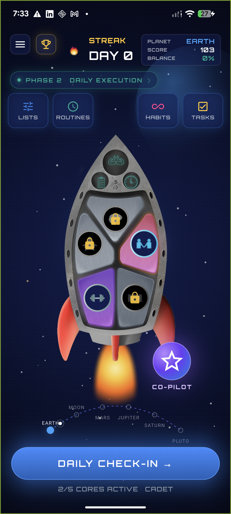
*The main cockpit (Screen 3.1). The rocket's 5 panels are the 5 Core Areas of Life; the phase pill shows whether the player is in Phase 1 (build) or Phase 2 (daily execution).*

---

## M0 — Foundation

### #1 Persist Phase 1 state to Firestore ✅

**What this is:** The player's onboarding progress (Stage 1 / Stage 2 completion, pyramid progress) and their current phase are now saved to the cloud, so they survive an app restart and sync across devices.

**Source — Document A**, the entire Phase 1 → Phase 2 progression depends on knowing *where the player is*. The "Re‑Entry Bridge" (returning to Phase 1 from the daily ritual) is built on this state. From Document A, section *"Path A: Rebuild This Habit → Phase 1, Stage 1 (HHS)"* and the returning‑player flows — these are only possible if Phase 1 progress is persisted.

**Built:** new `flutterSavePhase1State` cloud function + `phase1` fields on `flutterGetUserProfile` (the `phase` — `build` vs `daily` — is derived server‑side from `stage1Completed && stage2Completed`). Client: `ProfileService.savePhase1State`, write‑back on every Phase‑1 change and on each check‑in.

### #2 Real phase gating (cores grayed until first habit) ✅

**What this is:** Removed the temporary debug toggle. The dashboard now shows the player's *real* phase, score, streak and which Cores are active. A Core only lights up once the player has created a Golden Habit in it.

**Source — Document A**, section **"Core Unlocking — Progressive System"** *(extracted ref line 2140)*:

> "Cores appear grayed out until the player creates their first habit in that Core. Unlocks progressively as the player adds habits across additional Cores — encouraging holistic exploration across all 5 areas rather than over‑indexing on one."

**Built:** `flutterGetUserProfile` derives `activeCores` live from the `golden_habits` sub‑collection; the dashboard rocket renders a Core in colour only when active, grayed (with a gold lock) otherwise.

---

## M1 — Onboarding

### #3 HHS Stage 1 driven by the AI ✅

**What this is:** The first onboarding stage (the *Habits Hierarchy System*) is now an embedded AI conversation with "Nova" instead of hardcoded text — Pain Point → Core → Universal Principle → Keystone → Golden Habit, with a celebration + points at each checkpoint.

**Source — Document A**, section **"4A: Habits Hierarchy System (HHS)"** and the per‑section checkpoints *(extracted ref lines 32, 538…)*; and **Document B**, section *"Phase 1, Stage 1"* *(extracted ref line 225)*:

> "Momentum Points are introduced and earned at each Habits Hierarchy checkpoint: 10 pts (Truth Seeker) → 15 pts (Principle Decoder) → 20 pts (Keystone Forger) → 25 pts (Core Dimension Explorer) → 40 pts (Golden Habit Architect)."

**Built:** the live Nova chat (`hhs_chat_view.dart`) drives your existing Voiceflow onboarding agent; a read‑only `flutterSyncOnboarding` endpoint reports progress so the pyramid advances and the reward overlays fire from the points the agent awards. The forged Golden Habit is persisted and lights up its Core.

### #4 MBS Stage 2 real + Space Cantina unlock ✅

**What this is:** The second onboarding stage (the *3 Momentum Boosting Methods* — Make It Obvious / Easy / Rewarding + an IF‑THEN obstacle plan) is now real: the player's picks are saved onto their Golden Habit, three badges + points are awarded, and completing it **unlocks the Space Cantina**.

**Source — Document A**, section **"4A: Momentum Boosting System (MBS)"** *(extracted ref line 78)*; and **Document B**, section *"Phase 1, Stage 2"* *(extracted ref line 226)*:

> "Momentum Points continue: 10 pts (Friction Hunter) → 15 pts (Method Master) → 25 pts (Implementation Wizard). **Space Cantina unlock at Stage 2 completion** includes a 25 Space Credit welcome bonus."

**Built:** new `flutterSaveMomentumMethods` endpoint merges the 3 methods + IF‑THEN onto the active Golden Habit and awards Friction Hunter +10 / Method Master +15 / Implementation Wizard +25 once. The Cantina screen is gated behind persisted `stage2Completed` (a "locked" view deep‑links into Stage 2 until done).

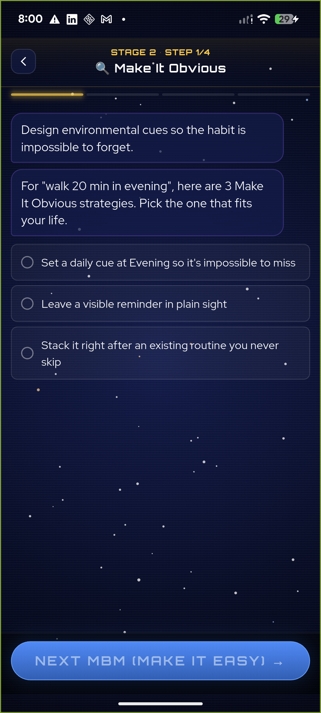
*Stage 2 (MBS): the player picks one Make‑It‑Obvious strategy, personalised from their real Golden Habit ("walk 20 min in evening"). Completing all three methods + the IF‑THEN plan unlocks the Cantina.*

---

## M2 — The Daily Ritual

### #5 Daily Ritual Step 0 — Mantra & Grateful List ✅

**What this is:** An optional, skippable screen shown *before* the daily scoring, to set the player's emotional state. It shows their Mantra and Grateful List and links into the Command Center.

**Source — Document A**, section **"STEP 0 (OPTIONAL): MANTRA & GRATEFUL LIST"** *(extracted ref lines 2176–2183)*:

> "Haven't done your Mantra or Grateful List yet today? Want to set your emotional state before reviewing yesterday's performance?
> [View Your Mantra] [View Your Grateful List]
> [Skip ‑ I'll Do This Later] [Continue to Scoring →]
> … If player clicks [View Your Mantra] or [View Your Grateful List], those lists open from Command Center, then return here."

**Built:** new `daily_ritual_step0.dart`, inserted ahead of the check‑in. It reads the player's Momentum Lists, matches the Mantra & Grateful buckets, and the "View" buttons open the Command Center Lists screen and return. Per‑day completion is remembered so it appears at most once a day.

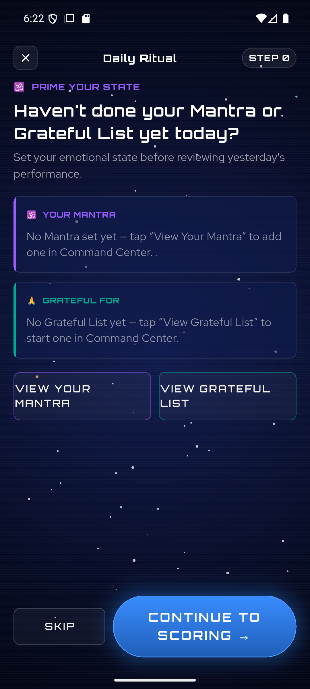 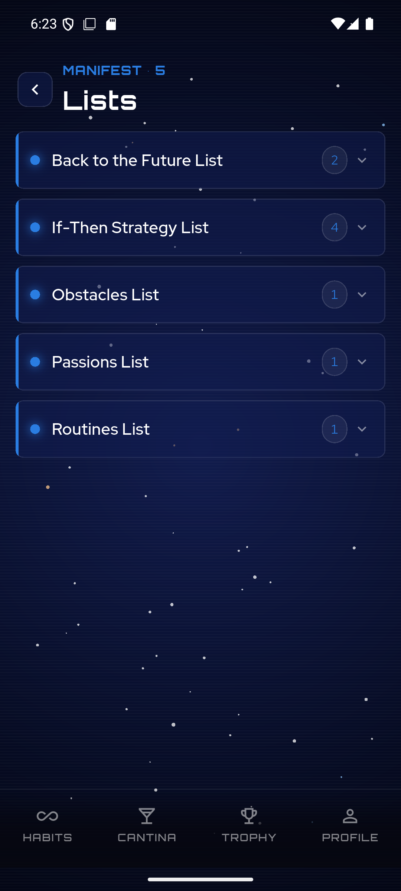
*Left: the Step 0 "prime your state" screen. Right: the Command Center / Momentum Lists it links into.*

### #6 Real numbers in the Progress Summary ✅

**What this is:** The post‑check‑in "Mission Recap" no longer shows fake numbers. Total Momentum and streak are real; the **5‑Core Balance Meter** is the real rolling 7‑day average of the player's check‑in scores. Anything that depends on systems not yet built is clearly marked "coming soon" — **no fabricated figures**.

**Source — Document A**, section *"Step 2 — Progress Summary"* and *"5 Core Balance Meter"* *(extracted ref lines 1997, 2033)*; and **Document B**, *"Core Balance Meter – Visual showing balance across all 5 cores with 7‑day rolling average."*

**Built:** `summary_page.dart` rewritten — Total Momentum + streak from the real profile; the Balance Meter computed from the last 7 days of real check‑ins. The economy stats (per‑check‑in points, Space Credits, Daily Challenge, Mystery Box) are shown as clearly‑labelled placeholders pending their engines.

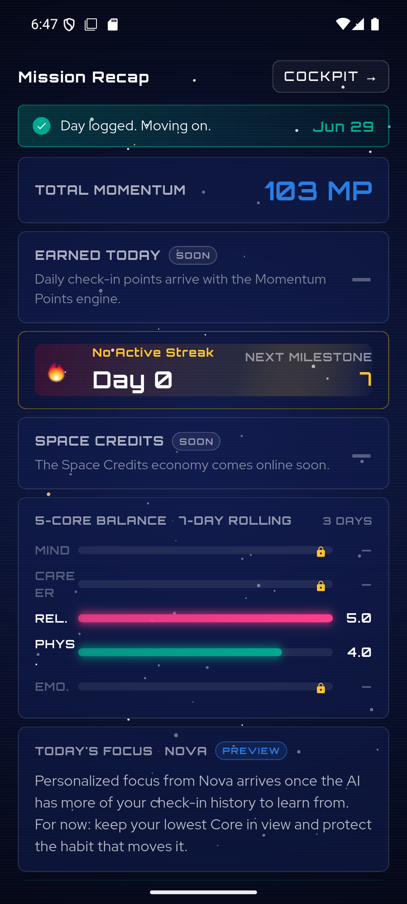
*The Mission Recap: real Total Momentum, real 5‑Core Balance Meter (Rel 5.0 / Phys 4.0 from actual scores), and honestly‑marked "SOON"/"PREVIEW"/"COMING SOON" placeholders for the not‑yet‑built economy.*

### #7 Persist Mission Control flags + AI auto‑flag ✅

**What this is:** When a habit is struggling, the player can flag it for refinement, and the AI auto‑flags a Core that's been low for several check‑ins. Flags are now **saved** to the Golden Habit, and "Go Deeper" carries the flagged habit back into Phase 1 to rebuild it.

**Source — Document C (Product Design Rationale)**, section on combined AI + player flagging *(extracted ref line 196)*:

> "AI auto‑flags when it detects: **3+ consecutive low scores on a habit**; recurring negative themes in Captain's Log entries referencing that habit; or a Core average trending below 3 for 3+ days. Players can manually flag any habit via a [Flag This Habit] button at any time. Both AI‑flagged and player‑flagged habits display a warning indicator in all views. Once flagged, the player selects a resolution path."

**Built:** the check‑in's Mission Control intervention now flags the Core's real Golden Habit via `flutterFlagGoldenHabit`; the "Pattern Detected" chart uses real recent scores; the auto‑flag fires on 3+ consecutive check‑ins ≤ 3.0; "Go Deeper → Better MBM Strategies" pre‑loads the flagged habit into Stage 2. *(Also fixed a rendering bug that was leaving the check‑in habit cards blank.)*

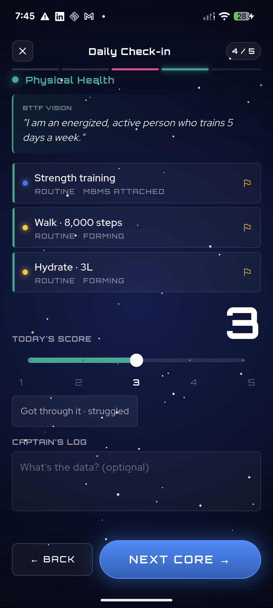
*The daily check‑in scoring a Core, with its habit rows and per‑habit flag (⚑) icons — these cards were rendering blank before this fix; tapping a flag opens Mission Control.*

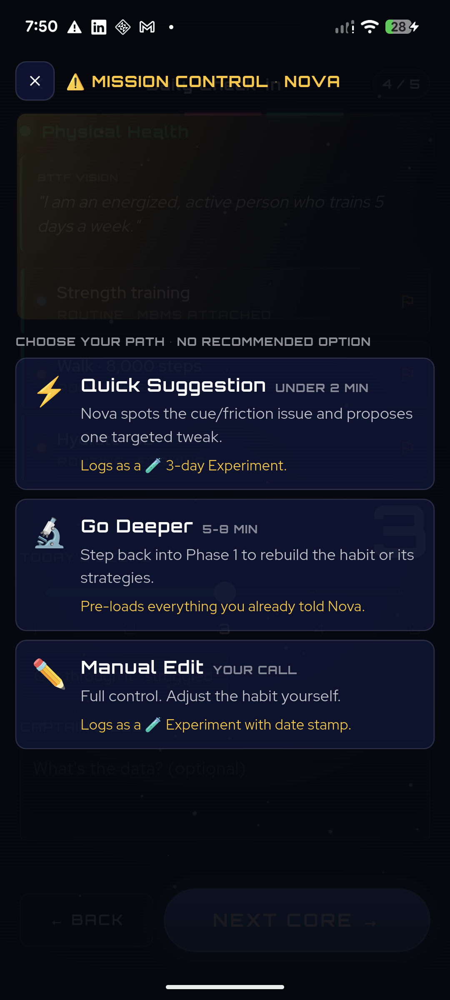 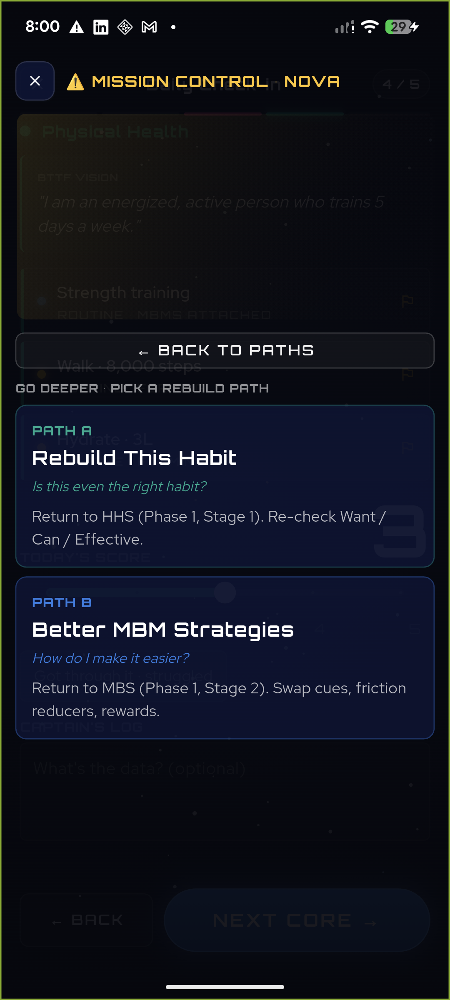
*Left: the three resolution paths (no "recommended" option, by design). Right: "Go Deeper" → Path A (rebuild the habit) / Path B (better strategies), which return the player into Phase 1.*

### #8 Core Balance 5‑day alert ✅

**What this is:** If any Core is scored below 3.0 for 5+ days in a row, a red ⚠️ badge appears on that Core (on the dashboard *and* in the check‑in). Tapping it opens a supportive "iCore Alert".

**Source — Document A**, section **"When a Core Is Out of Balance"** *(extracted ref lines 2132–2138)*:

> "Red alert badge appears on the Core section (⚠️). Tapping opens an 'iCore Alert' message: **'This core is unbalanced. You should focus your work to improve it.'** Shows recent low scores (below 3.0 for 5+ days). Suggests reviewing habits in that Core. Links to detailed habit views. [Done] button to acknowledge."

**Built:** detection (`isCoreOutOfBalance` = 5+ consecutive days < 3.0) from real check‑ins; a red badge on the dashboard rocket Core and an "AT RISK" chip in the check‑in; both open the new `CoreAlertSheet` carrying the exact spec copy, the recent low scores, review links, and a [Done] button.

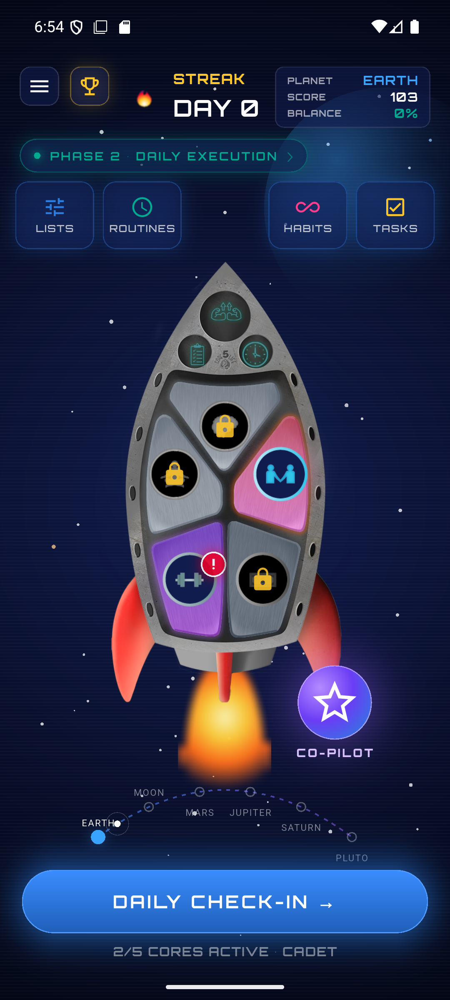 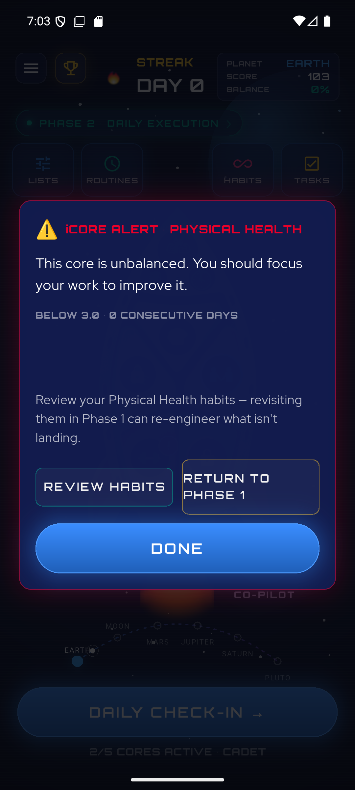 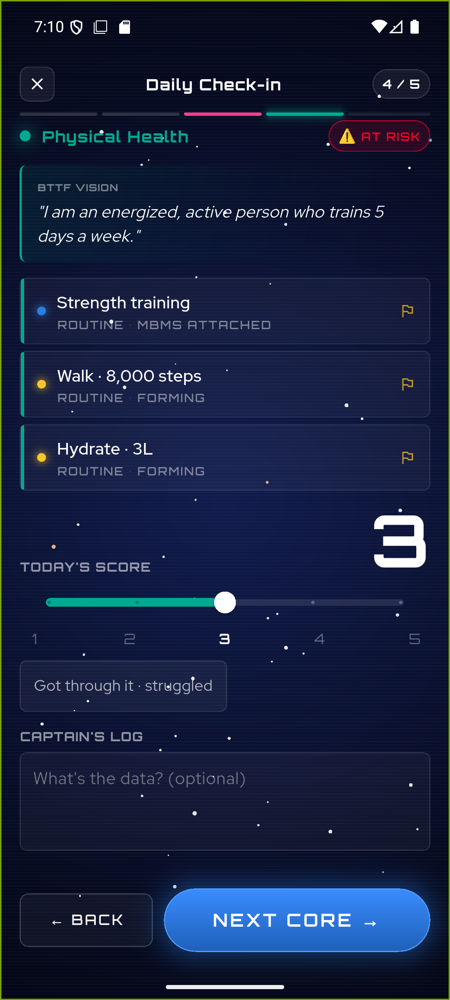
*Left: the red ⚠️ badge on an out‑of‑balance Core on the rocket. Middle: the iCore Alert, with the exact wording from your spec. Right: the same alert is reachable from the "AT RISK" chip during the daily check‑in.*

---

## M3 — Economy core

### #9 Momentum Points engine ✅

**What this is:** Completing a weekday check‑in now awards **+10 Momentum Points**, saved to the player's running total with a per‑check‑in record, and shown as "Earned Today" on the recap.

**Source — Document B (Gamification Mechanics Specs Reference)** *(extracted ref line 161)*:

> "**+10 points per completed weekday check‑in regardless of scores** — consistency matters most, not perfection."

**Built:** new `flutterAwardCheckinPoints` endpoint awards +10 per completed weekday check‑in, **idempotent per day** (re‑opening the check‑in won't double‑award), written to the same `points/summary` + history + mirror schema as the Phase‑1 awards. Weekends and empty check‑ins award 0. The high‑score (5/5), streak‑milestone and Balance bonuses — which are marked **[PLACEHOLDER]** in your docs — are **stubbed** (the hook detects eligibility but awards 0 and flags "needs spec") rather than inventing numbers.

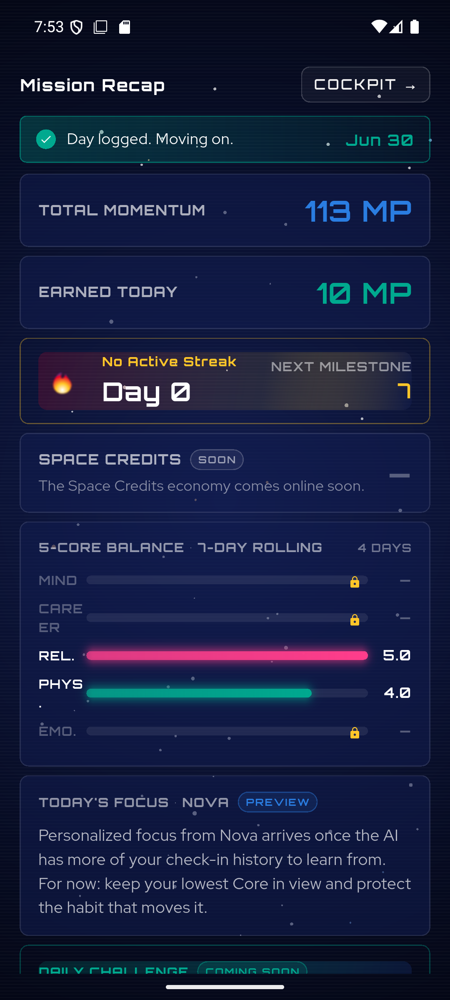
*After a weekday check‑in: Total Momentum rises 103 → 113 and "Earned Today" shows the real +10 MP.*

> **Note on placeholders:** Your Gamification doc intentionally leaves several amounts as `[PLACEHOLDER — DETAIL NEEDED]` (e.g. the high‑score bonus, streak‑milestone payouts, regression thresholds). Wherever a number wasn't specified, the code **stubs the hook and surfaces "needs spec"** instead of guessing — so nothing fabricated ever ships. These are ready to wire the moment you confirm the values.

### #10 Streak system ✅

**What this is:** A streak now tracks consecutive **weekday** check‑ins with a **4.0+ average**. Weekends never break it, one missed weekday is a grace "warning," and two missed weekdays reset it. Milestones (3/7/14/…/365) are detected.

**Source — Document B (Gamification Mechanics Specs Reference), Section 6 "Streaks & Accountability"** *(extracted ref lines 335, 358–367)*:

> "A streak requires consecutive WEEKDAYS (Monday–Friday) on which the player completes a check‑in AND achieves a 4.0+ average score across all active Cores. Weekends … are always exempt … MISS 1 WEEKDAY CHECK‑IN — Warning Only … Streak remains intact … MISS 2 CONSECUTIVE WEEKDAY CHECK‑INS … Streak is broken … Always preserved: Space Credits, Trophy Room, … Level and all earned achievements."

**Built:** the check‑in award (`flutterAwardCheckinPoints`) updates the streak in the same step — weekend‑exempt, a 1‑weekday grace ("warning"), reset on 2+ missed weekdays — persisting `streak` / `lastCheckinDate` / `longestStreak`. The profile read reports the **effective** streak (shown as *ok / warning / broken*) so the dashboard is truthful between check‑ins. Milestones are **detected** (the reward amounts are `[PLACEHOLDER]` in your docs, so payouts are **stubbed**, not invented). The dashboard streak turns amber‑warning at 1 missed weekday; the recap celebrates a milestone.

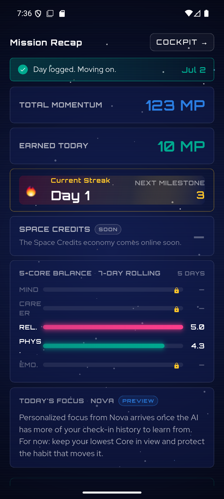
*A qualifying weekday check‑in starts the streak — "Current Streak · Day 1" with the next milestone at 3, alongside the real +10 Momentum Points.*

---

## 3. Engineering notes (for your technical reviewer)

- **Backend isolation:** all new cloud functions live in the **Flutter‑only** functions codebase (`vf-bridge/functions-flutter`), never in the FlutterFlow `index.js`. New endpoints added this phase: `flutterSavePhase1State`, `flutterSaveMomentumMethods`, `flutterFlagGoldenHabit` (client wiring), `flutterAwardCheckinPoints`, plus read endpoints `flutterGetUserProfile` / `flutterGetGoldenHabits` / `flutterSyncOnboarding`.
- **Points schema:** `users/{uid}/points/summary.total` is the source of truth for `momentumScore`, mirrored to `users/{uid}.points`, with an immutable `history` sub‑collection of awards.
- **Verification:** every feature was exercised on a real device/emulator and, where it touches the backend, confirmed against the live endpoints. Two effects need multi‑day history to trigger live (the #7 auto‑flag and #8 5‑day alert); their UI and persistence are verified, and the day‑counting logic is covered — they simply can't be "clicked" without several calendar days of data.

---

## 4. What's next

- **#11 Trophy Room** from real habit formation (14+ days, ≥80% consistency).
- **#12 Profile** real data.
- **Deferred (need your numbers):** the full gamified economy (Space Credits, levels, planets, ship upgrades, Mystery Box, badge library) and the full Space Cantina build — both gated on the `[PLACEHOLDER]` values in your Gamification & Cantina docs.

*All screenshots in `./images/` were captured from the working app during this build.*
