> **⚠️ 2026-09-19 — Voiceflow has been retired.** Nova (HHS Stage 1) runs on the Claude API only via
> `claudeLaunchConversation` / `claudeSendMessage` / `claudeGetLatestMessages` / `claudeSyncOnboarding`
> ("flutter" codebase, official Anthropic SDK). The app no longer calls `vf*`, `flutterSyncOnboarding`, or
> `flutterForgeFromTranscript`, and celebrations trigger from the points ledger only (no `vf_events`).
> Voiceflow references below are **historical**.

# Moore Momentum — Build Progress & Documentation Traceability

**Prepared for:** Will Moore (client)
**App:** Moore Momentum (plain‑Flutter rebuild)
**Last updated:** 2026‑08‑03

This document maps **every feature built so far** back to **your original specification documents**, quotes the exact passage each feature was built from, and shows a **screenshot of the working app**. The goal is a single place where you can see *what was built*, *why* (which of your docs drove it), and *that it works*.

---

## 1. Your source documents

All features are traced to the four specification files you provided in
`C:\Users\haroon\Downloads\willMoore (2)\rules`:

| # | Original document (`.docx`) | Used for |
|---|------------------------------|----------|
| A | **PHASE 1 AND 2 SEQUENCE (SIMPLEST INCL. PLAYER FACING WALKTHROUGH VERSION FOR CODERS) (2).docx** | The master spec — onboarding (HHS / MBS), the Daily Ritual, Core Balance, Command Center. |
| B | **Gamification Mechanics Specs Reference (Pre‑PRD).docx** | Momentum Points, streaks, badges, Space Credits economy. |
| C | **Product Design Rationale.docx** | The *why* behind the AI flagging + Core Balance enforcement. |
| D | **Space Cantina – Social Component Of The MM System.docx** | The social hub (Cantina) gating + rollout. |
| E | **MM Build Guide.docx** | The master 80‑feature MVP spec (WHAT/WHY per feature). Cross‑referenced feature‑by‑feature in `COMPLETION_PLAN.md`; used to confirm nothing in the MVP scope is untracked. |

> **How to find a quote in your docs:** Word `.docx` files don't have stable page numbers, so each citation below gives the **section heading** + the **verbatim quoted text**. Open the document, use **Ctrl‑F**, and paste the quote to jump straight to it. For our internal traceability we also note the line number in the plain‑text extraction stored in `design/ref/_extracted/…`.

**Screenshots** referenced below live in `./images/`. They were captured from the running app on a physical **Pixel 6** and an Android emulator during verification.

---

## 2. Progress at a glance

| Milestone | Feature | Status |
|---|---|---|
| **M0 Foundation** | #1 Persist Phase 1 state to Firestore | ✅ Done |
| | #2 Real phase gating (no debug toggle) | ✅ Done |
| **M1 Onboarding** | #3 HHS Stage 1 driven by the AI | ✅ Done |
| | #4 MBS Stage 2 real + Cantina unlock | ✅ Done |
| **M2 Daily ritual** | #5 Daily Ritual Step 0 (Mantra & Gratitude) | ✅ Done |
| | #6 Real numbers in Progress Summary | ✅ Done |
| | #7 Persist Mission Control flags + AI auto‑flag | ✅ Done |
| | #8 Core Balance 5‑day alert | ✅ Done |
| **M3 Economy** | #9 Momentum Points engine | ✅ Done |
| | #10 Streak system | ✅ Done |
| | #11 Trophy Room from real formation | ✅ Done |
| **M4** | #12 Profile screen real data | ✅ Done |
| **M5 Space Credits** | #13a Space Credits ledger + earning (Set ①) | ✅ Done |
| | #13g Dashboard Space Credits readout | ✅ Done |
| | #13b–f leveling / planets / ship / mystery box / badges | 🔒 Blocked on your numbers |
| **M6 Social & tools** | #14 Momentum Lists editing | ✅ Done |
| | #14 Tasks screen (real to‑do) | ✅ Done |
| | #14 Cantina V1 — Ideas Well | ✅ Done |
| | #14 Cantina V1 — Space Tribes | ✅ Done |
| | #14 Cantina V1 — Accountability Partners | ✅ Done |
| | #14 Cantina — Leaderboard / Arena | ⏳ Next / V2 |
| **Web** | Desktop web shell + Cockpit + secondary screens | ✅ Done |
| **Mobile** | Journey stage on mobile (planet states at parity with desktop) | ✅ Done |
| **Co‑Pilot** | Console layout — text on the cockpit screen, images play as a take‑over | ✅ Done (parallel page, awaiting your pick) |

The canonical living backlog is `COMPLETION_PLAN.md` in the project root.

> **Platform note (2026‑07):** the **web / desktop build is now the primary shipping surface**. Every
> feature below is verified in the browser as well as on device where noted; the desktop layouts live
> in `web_screens.dart` behind a ≥900px responsive shell.

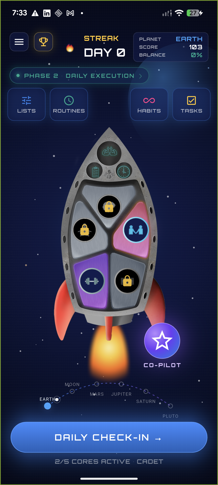
*The main cockpit (Screen 3.1). The rocket's 5 panels are the 5 Core Areas of Life; the phase pill shows whether the player is in Phase 1 (build) or Phase 2 (daily execution).*

---

## M0 — Foundation

### #1 Persist Phase 1 state to Firestore ✅

**What this is:** The player's onboarding progress (Stage 1 / Stage 2 completion, pyramid progress) and their current phase are now saved to the cloud, so they survive an app restart and sync across devices.

**Source — Document A**, the entire Phase 1 → Phase 2 progression depends on knowing *where the player is*. The "Re‑Entry Bridge" (returning to Phase 1 from the daily ritual) is built on this state. From Document A, section *"Path A: Rebuild This Habit → Phase 1, Stage 1 (HHS)"* and the returning‑player flows — these are only possible if Phase 1 progress is persisted.

**Built:** new `flutterSavePhase1State` cloud function + `phase1` fields on `flutterGetUserProfile` (the `phase` — `build` vs `daily` — is derived server‑side from `stage1Completed && stage2Completed`). Client: `ProfileService.savePhase1State`, write‑back on every Phase‑1 change and on each check‑in.

### #2 Real phase gating (cores grayed until first habit) ✅

**What this is:** Removed the temporary debug toggle. The dashboard now shows the player's *real* phase, score, streak and which Cores are active. A Core only lights up once the player has created a Golden Habit in it.

**Source — Document A**, section **"Core Unlocking — Progressive System"** *(extracted ref line 2140)*:

> "Cores appear grayed out until the player creates their first habit in that Core. Unlocks progressively as the player adds habits across additional Cores — encouraging holistic exploration across all 5 areas rather than over‑indexing on one."

**Built:** `flutterGetUserProfile` derives `activeCores` live from the `golden_habits` sub‑collection; the dashboard rocket renders a Core in colour only when active, grayed (with a gold lock) otherwise.

---

## M1 — Onboarding

### #3 HHS Stage 1 driven by the AI ✅

**What this is:** The first onboarding stage (the *Habits Hierarchy System*) is now an embedded AI conversation with "Nova" instead of hardcoded text — Pain Point → Core → Universal Principle → Keystone → Golden Habit, with a celebration + points at each checkpoint.

**Source — Document A**, section **"4A: Habits Hierarchy System (HHS)"** and the per‑section checkpoints *(extracted ref lines 32, 538…)*; and **Document B**, section *"Phase 1, Stage 1"* *(extracted ref line 225)*:

> "Momentum Points are introduced and earned at each Habits Hierarchy checkpoint: 10 pts (Truth Seeker) → 15 pts (Principle Decoder) → 20 pts (Keystone Forger) → 25 pts (Core Dimension Explorer) → 40 pts (Golden Habit Architect)."

**Built:** the live Nova chat (`hhs_chat_view.dart`) drives your existing Voiceflow onboarding agent; a read‑only `flutterSyncOnboarding` endpoint reports progress so the pyramid advances and the reward overlays fire from the points the agent awards. The forged Golden Habit is persisted and lights up its Core.

### #4 MBS Stage 2 real + Space Cantina unlock ✅

**What this is:** The second onboarding stage (the *3 Momentum Boosting Methods* — Make It Obvious / Easy / Rewarding + an IF‑THEN obstacle plan) is now real: the player's picks are saved onto their Golden Habit, three badges + points are awarded, and completing it **unlocks the Space Cantina**.

**Source — Document A**, section **"4A: Momentum Boosting System (MBS)"** *(extracted ref line 78)*; and **Document B**, section *"Phase 1, Stage 2"* *(extracted ref line 226)*:

> "Momentum Points continue: 10 pts (Friction Hunter) → 15 pts (Method Master) → 25 pts (Implementation Wizard). **Space Cantina unlock at Stage 2 completion** includes a 25 Space Credit welcome bonus."

**Built:** new `flutterSaveMomentumMethods` endpoint merges the 3 methods + IF‑THEN onto the active Golden Habit and awards Friction Hunter +10 / Method Master +15 / Implementation Wizard +25 once. The Cantina screen is gated behind persisted `stage2Completed` (a "locked" view deep‑links into Stage 2 until done).

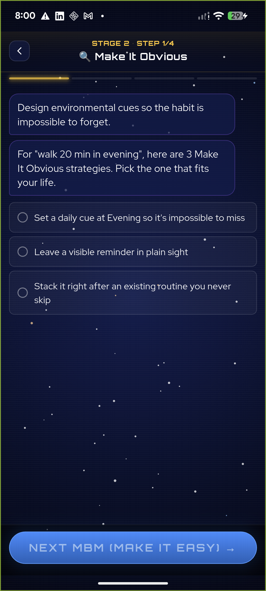
*Stage 2 (MBS): the player picks one Make‑It‑Obvious strategy, personalised from their real Golden Habit ("walk 20 min in evening"). Completing all three methods + the IF‑THEN plan unlocks the Cantina.*

---

## M2 — The Daily Ritual

### #5 Daily Ritual Step 0 — Mantra & Grateful List ✅

**What this is:** An optional, skippable screen shown *before* the daily scoring, to set the player's emotional state. It shows their Mantra and Grateful List and links into the Command Center.

**Source — Document A**, section **"STEP 0 (OPTIONAL): MANTRA & GRATEFUL LIST"** *(extracted ref lines 2176–2183)*:

> "Haven't done your Mantra or Grateful List yet today? Want to set your emotional state before reviewing yesterday's performance?
> [View Your Mantra] [View Your Grateful List]
> [Skip ‑ I'll Do This Later] [Continue to Scoring →]
> … If player clicks [View Your Mantra] or [View Your Grateful List], those lists open from Command Center, then return here."

**Built:** new `daily_ritual_step0.dart`, inserted ahead of the check‑in. It reads the player's Momentum Lists, matches the Mantra & Grateful buckets, and the "View" buttons open the Command Center Lists screen and return. Per‑day completion is remembered so it appears at most once a day.

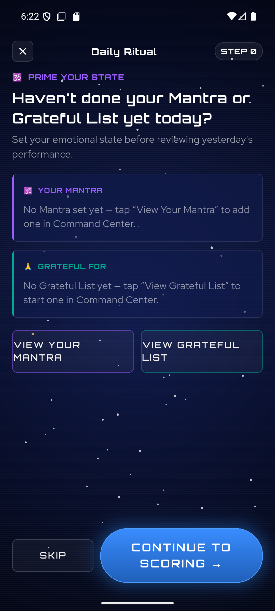 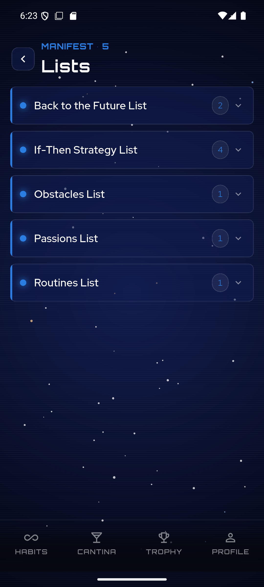
*Left: the Step 0 "prime your state" screen. Right: the Command Center / Momentum Lists it links into.*

### #6 Real numbers in the Progress Summary ✅

**What this is:** The post‑check‑in "Mission Recap" no longer shows fake numbers. Total Momentum and streak are real; the **5‑Core Balance Meter** is the real rolling 7‑day average of the player's check‑in scores. Anything that depends on systems not yet built is clearly marked "coming soon" — **no fabricated figures**.

**Source — Document A**, section *"Step 2 — Progress Summary"* and *"5 Core Balance Meter"* *(extracted ref lines 1997, 2033)*; and **Document B**, *"Core Balance Meter – Visual showing balance across all 5 cores with 7‑day rolling average."*

**Built:** `summary_page.dart` rewritten — Total Momentum + streak from the real profile; the Balance Meter computed from the last 7 days of real check‑ins. The economy stats (per‑check‑in points, Space Credits, Daily Challenge, Mystery Box) are shown as clearly‑labelled placeholders pending their engines.

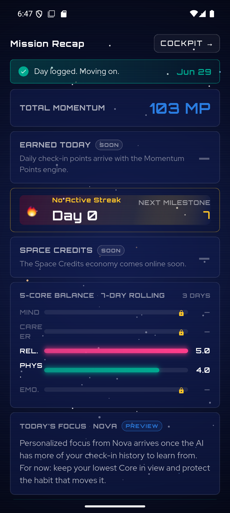
*The Mission Recap: real Total Momentum, real 5‑Core Balance Meter (Rel 5.0 / Phys 4.0 from actual scores), and honestly‑marked "SOON"/"PREVIEW"/"COMING SOON" placeholders for the not‑yet‑built economy.*

### #7 Persist Mission Control flags + AI auto‑flag ✅

**What this is:** When a habit is struggling, the player can flag it for refinement, and the AI auto‑flags a Core that's been low for several check‑ins. Flags are now **saved** to the Golden Habit, and "Go Deeper" carries the flagged habit back into Phase 1 to rebuild it.

**Source — Document C (Product Design Rationale)**, section on combined AI + player flagging *(extracted ref line 196)*:

> "AI auto‑flags when it detects: **3+ consecutive low scores on a habit**; recurring negative themes in Captain's Log entries referencing that habit; or a Core average trending below 3 for 3+ days. Players can manually flag any habit via a [Flag This Habit] button at any time. Both AI‑flagged and player‑flagged habits display a warning indicator in all views. Once flagged, the player selects a resolution path."

**Built:** the check‑in's Mission Control intervention now flags the Core's real Golden Habit via `flutterFlagGoldenHabit`; the "Pattern Detected" chart uses real recent scores; the auto‑flag fires on 3+ consecutive check‑ins ≤ 3.0; "Go Deeper → Better MBM Strategies" pre‑loads the flagged habit into Stage 2. *(Also fixed a rendering bug that was leaving the check‑in habit cards blank.)*

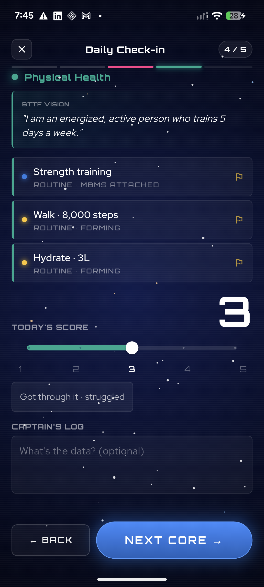
*The daily check‑in scoring a Core, with its habit rows and per‑habit flag (⚑) icons — these cards were rendering blank before this fix; tapping a flag opens Mission Control.*

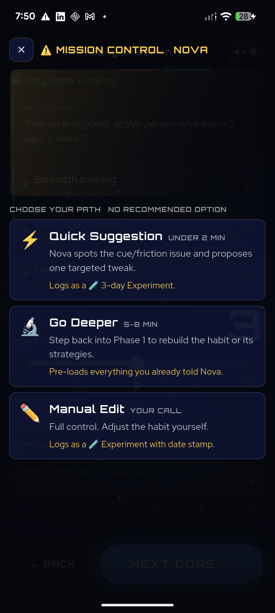 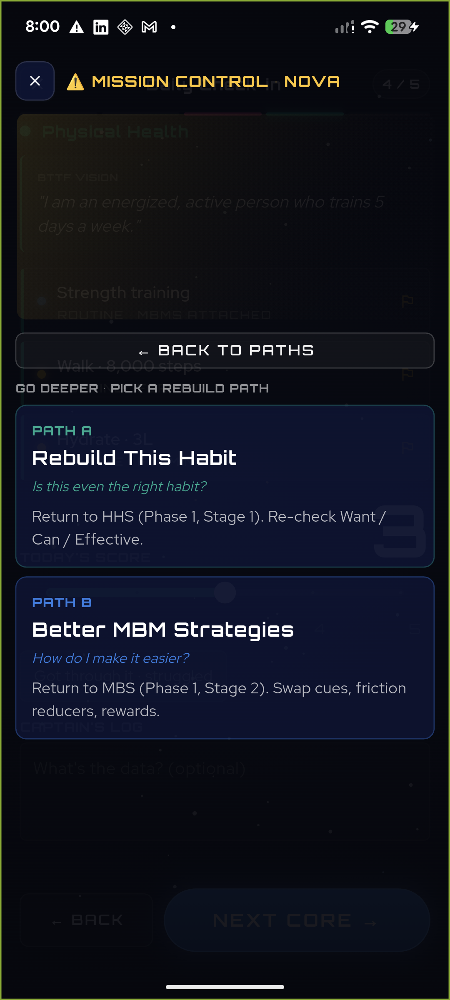
*Left: the three resolution paths (no "recommended" option, by design). Right: "Go Deeper" → Path A (rebuild the habit) / Path B (better strategies), which return the player into Phase 1.*

### #8 Core Balance 5‑day alert ✅

**What this is:** If any Core is scored below 3.0 for 5+ days in a row, a red ⚠️ badge appears on that Core (on the dashboard *and* in the check‑in). Tapping it opens a supportive "iCore Alert".

**Source — Document A**, section **"When a Core Is Out of Balance"** *(extracted ref lines 2132–2138)*:

> "Red alert badge appears on the Core section (⚠️). Tapping opens an 'iCore Alert' message: **'This core is unbalanced. You should focus your work to improve it.'** Shows recent low scores (below 3.0 for 5+ days). Suggests reviewing habits in that Core. Links to detailed habit views. [Done] button to acknowledge."

**Built:** detection (`isCoreOutOfBalance` = 5+ consecutive days < 3.0) from real check‑ins; a red badge on the dashboard rocket Core and an "AT RISK" chip in the check‑in; both open the new `CoreAlertSheet` carrying the exact spec copy, the recent low scores, review links, and a [Done] button.

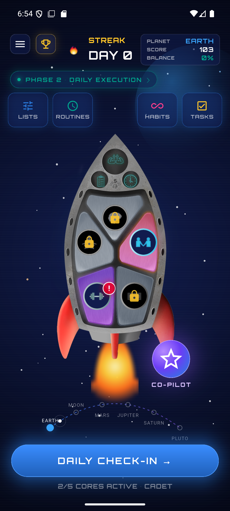 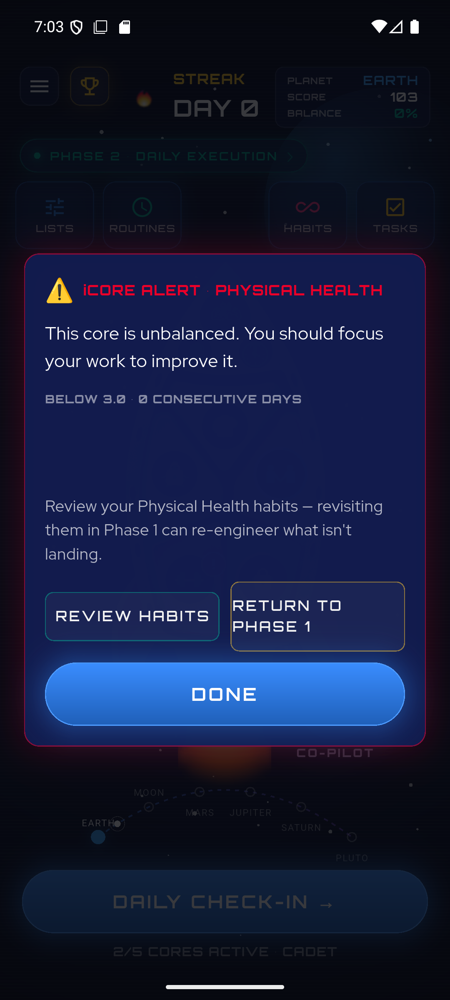 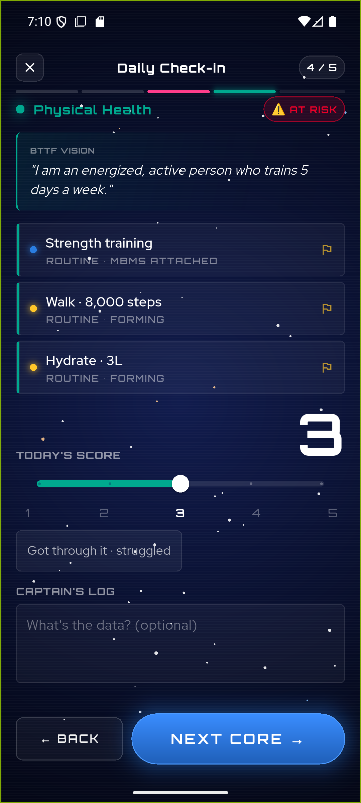
*Left: the red ⚠️ badge on an out‑of‑balance Core on the rocket. Middle: the iCore Alert, with the exact wording from your spec. Right: the same alert is reachable from the "AT RISK" chip during the daily check‑in.*

---

## M3 — Economy core

### #9 Momentum Points engine ✅

**What this is:** Completing a weekday check‑in now awards **+10 Momentum Points**, saved to the player's running total with a per‑check‑in record, and shown as "Earned Today" on the recap.

**Source — Document B (Gamification Mechanics Specs Reference)** *(extracted ref line 161)*:

> "**+10 points per completed weekday check‑in regardless of scores** — consistency matters most, not perfection."

**Built:** new `flutterAwardCheckinPoints` endpoint awards +10 per completed weekday check‑in, **idempotent per day** (re‑opening the check‑in won't double‑award), written to the same `points/summary` + history + mirror schema as the Phase‑1 awards. Weekends and empty check‑ins award 0. The high‑score (5/5), streak‑milestone and Balance bonuses — which are marked **[PLACEHOLDER]** in your docs — are **stubbed** (the hook detects eligibility but awards 0 and flags "needs spec") rather than inventing numbers.

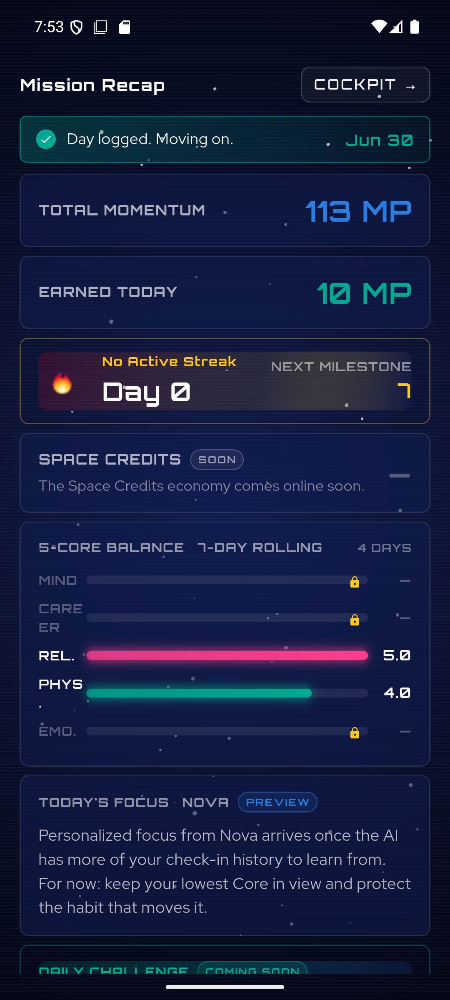
*After a weekday check‑in: Total Momentum rises 103 → 113 and "Earned Today" shows the real +10 MP.*

> **Note on placeholders:** Your Gamification doc intentionally leaves several amounts as `[PLACEHOLDER — DETAIL NEEDED]` (e.g. the high‑score bonus, streak‑milestone payouts, regression thresholds). Wherever a number wasn't specified, the code **stubs the hook and surfaces "needs spec"** instead of guessing — so nothing fabricated ever ships. These are ready to wire the moment you confirm the values.

### #10 Streak system ✅

**What this is:** A streak now tracks consecutive **weekday** check‑ins with a **4.0+ average**. Weekends never break it, one missed weekday is a grace "warning," and two missed weekdays reset it. Milestones (3/7/14/…/365) are detected.

**Source — Document B (Gamification Mechanics Specs Reference), Section 6 "Streaks & Accountability"** *(extracted ref lines 335, 358–367)*:

> "A streak requires consecutive WEEKDAYS (Monday–Friday) on which the player completes a check‑in AND achieves a 4.0+ average score across all active Cores. Weekends … are always exempt … MISS 1 WEEKDAY CHECK‑IN — Warning Only … Streak remains intact … MISS 2 CONSECUTIVE WEEKDAY CHECK‑INS … Streak is broken … Always preserved: Space Credits, Trophy Room, … Level and all earned achievements."

**Built:** the check‑in award (`flutterAwardCheckinPoints`) updates the streak in the same step — weekend‑exempt, a 1‑weekday grace ("warning"), reset on 2+ missed weekdays — persisting `streak` / `lastCheckinDate` / `longestStreak`. The profile read reports the **effective** streak (shown as *ok / warning / broken*) so the dashboard is truthful between check‑ins. Milestones are **detected** (the reward amounts are `[PLACEHOLDER]` in your docs, so payouts are **stubbed**, not invented). The dashboard streak turns amber‑warning at 1 missed weekday; the recap celebrates a milestone.

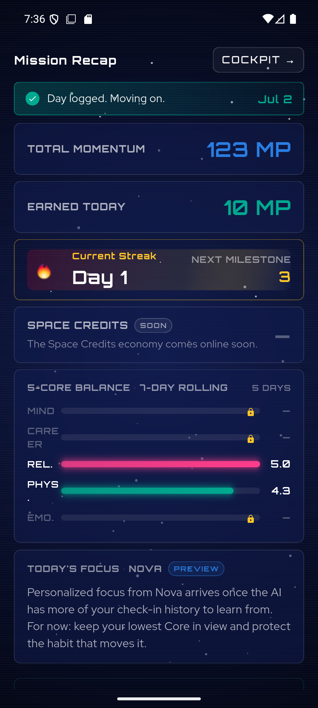
*A qualifying weekday check‑in starts the streak — "Current Streak · Day 1" with the next milestone at 3, alongside the real +10 Momentum Points.*

### #11 Trophy Room from real formation ✅

**What this is:** The Trophy Room now shows the player's **real** Golden Habits and whether each has formed. A habit is *formed* automatically after 14+ days of ≥80% consistency on its Core, or the player can **manually mark it formed** after a 2‑week‑standard confirmation. Habits still forming show a progress bar.

**Source — Document B (Gamification Mechanics Specs Reference), Section 8 "Trophy Room & Habit Formation"** *(extracted ref lines 446–449)*:

> "Formation Eligibility Threshold: **14+ days with 80%+ consistency** (scoring 3 or above on the habit's Core on days the habit applies) … Early formation option: **player can manually mark a habit formed earlier with a confirmation prompt acknowledging the 2+ week research‑backed standard.**"

**Built:** `TrophyScreen` was rewritten to pull real Golden Habits + the last 30 days of check‑ins. Formed = the manual flag **or** the auto rule (`deriveRoutineStage == 'formed'` — 14 days / ≥80% on the Core). Formed habits appear as 🏆 trophies grouped by Core; still‑forming habits show a `{days}/14` progress bar and a **"Mark as Formed"** button → a 2‑week‑standard confirm dialog → a new `flutterSetHabitFormed` endpoint records `formed` + `formedAt`.

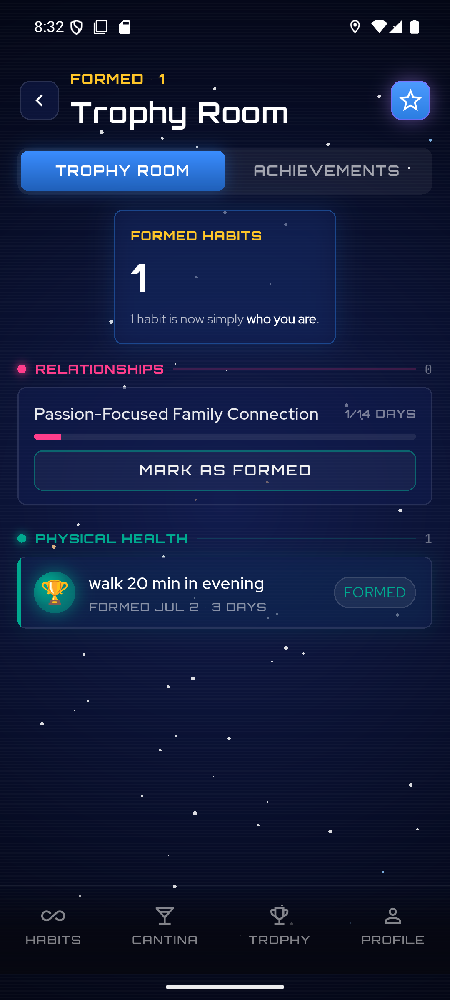
*After marking one habit formed: "walk 20 min in evening" becomes a 🏆 trophy ("FORMED JUL 2 · 3 DAYS"), the count rises to 1, and the other habit keeps its progress bar + "Mark as Formed" action.*

---

## M4 — Profile

### #12 Profile screen real data ✅

**What this is:** The Profile screen now shows the player's **real** name, level, streak and Momentum score, and a **5‑Core radar** computed from their actual check‑in averages — no more placeholder "Alex Moore / 78‑65‑42‑81‑54." Settings that aren't wired yet are clearly marked, and Sign Out works.

**Source — Document B (Gamification Mechanics Specs Reference), Section 2 "Progressive Leveling System: Cadet → Navigator → Commander"** *(extracted ref line 107)*; the radar reuses the **5‑Core Balance Meter** concept (see #6). The level tiers themselves carry `[PLACEHOLDER]` advancement thresholds in your doc, so the screen shows the player's current level as stored rather than inventing a level number.

**Built:** `ProfileScreen` now reads the real profile (`flutterGetUserProfile`) and the last 30 days of check‑ins. The header shows the real name (avatar = first initial), level, streak 🔥 and Momentum score; the 5‑Core radar is the per‑Core rolling **7‑day average** of check‑in scores. Notifications / Connected calendars / Privacy / Subscription are tagged **"SOON"** (a tap shows a "coming soon" note); **Sign out** remains fully functional.

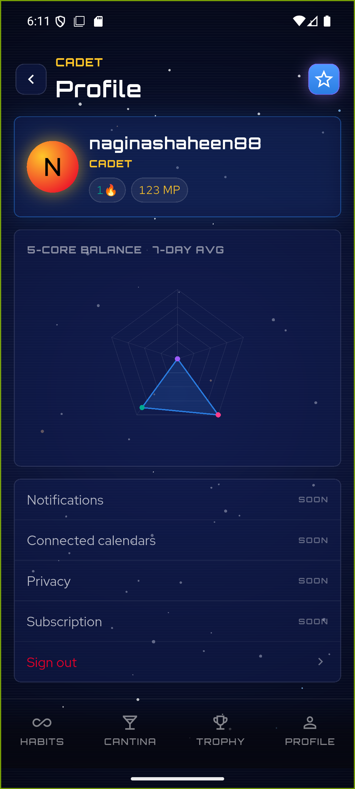
*The real profile: "naginashaheen88 · CADET · 1🔥 · 123 MP", a live 5‑Core radar from actual check‑ins (Physical & Relationships extended, the rest centred), and the not‑yet‑wired settings clearly marked "SOON".*

---

## M5 — Space Credits economy (the parts you've specified)

The full gamified economy (leveling thresholds, planet journey, ship upgrades, Mystery Box odds, the
badge library) is still **blocked on numbers only you can set** — those remain `[PLACEHOLDER]` in your
Gamification doc and are listed in *"What's next."* But the **Space Credits earning loop** you *did*
specify is now fully built and live.

### #13a Space Credits ledger + earning ✅

**What this is:** Space Credits (💎) are the app's spendable currency. There's now a real credits ledger, and the player **earns credits** on every qualifying weekday check‑in, on a perfect 5/5 Core, on habit formation, and at each streak milestone — all multiplied by their level rank.

**Source — Document B (Gamification Mechanics Specs Reference)**, the Space Credits economy + the level‑rank multiplier, and the amounts you confirmed on 2026‑07‑07:

> Base **10💎** per completed weekday check‑in · **+5💎** high‑score bonus when any Core scores 5/5 · **25💎** on habit formation · streak‑milestone credits **3/7/14/30/60/90/180/365 → 10/25/50/100/200/300/500/1000💎** · all × the level multiplier (Cadet 1× / Navigator 1.25× / Commander 1.5×) · plus the **25💎 Space Cantina welcome bonus** at Stage 2 completion.

**Built:** a credits schema mirroring the points schema — `users/{uid}/credits/summary.total` + immutable `history` sub‑collection + a `users/{uid}.spaceCredits` mirror. `flutterAwardCheckinPoints` now awards the base 10💎 + 5💎 high‑score + the streak‑milestone credits (each × level multiplier, idempotent per day via deterministic history ids); `flutterSetHabitFormed` awards the 25💎 formation bonus once per habit; `flutterSaveMomentumMethods` awards the 25💎 Cantina welcome once. The one still‑undesigned amount — the **Balance bonus** — is left as a stub (surfaces "needs spec", never fabricated). **Verified:** curl‑verified across simulated weekdays (check‑in +15 = 10+5, streak day‑3 milestone +10, formation +25, all idempotent) and **device‑verified on the physical Pixel 6** (dashboard credits 25 → 65).

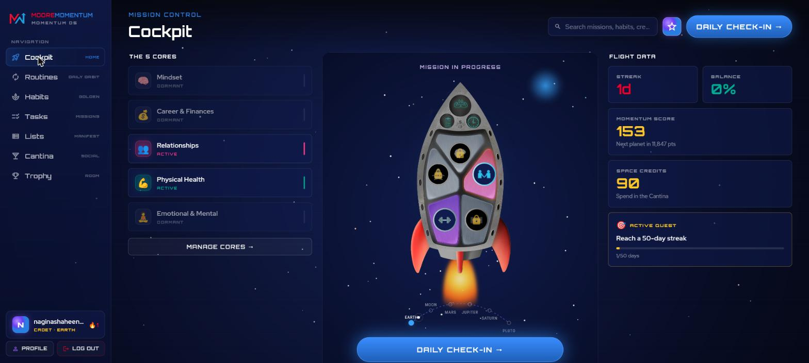
*The desktop Web Cockpit (also the flagship web surface — see the Web section). "Flight Data" shows the real economy: Momentum Score 153, **Space Credits 90**, a 1‑day streak, and the active quest — all from the #13a ledger.*

### #13g Dashboard Space Credits readout ✅

**What this is:** The dashboard's top status bar now shows the player's live **Space Credits** balance, next to Planet, Score and Balance — matching your design mockups (`gam-05`, `phase-01`, `phase-03`), which all show credits in that bar.

**Source — Document B / design‑reference images**, which show the cockpit status bar carrying 💎 Space Credits alongside the Momentum Score and Planet.

**Built:** a `CREDITS · N 💎` readout added to the dashboard status bar, fed by the real `profile.spaceCredits` from the #13a ledger. **Device‑verified** on the physical Pixel 6 (shows "CREDITS · 25 💎").

> **Note on placeholders:** the rest of #13 — the Cadet→Navigator→Commander leveling thresholds, the planet journey (MP per planet + arrival bonuses), ship upgrades (per‑tier credit costs **and** the rocket art assets, which don't exist yet), the Mystery Box odds, and the badge library — is **ready to wire the moment you confirm the numbers/assets.** Nothing there is guessed. See *"What's next."*

---

## M6 — Social hub & productivity tools

### #14 Momentum Lists — now editable ✅

**What this is:** The Command Center's Momentum Lists were read‑only; they're now fully editable. The player can add, edit and delete items in any list, and create brand‑new lists (with your 17 canonical Build‑Guide list names offered as suggestions).

**Source — Document A**, the Command Center / Momentum Lists as the player's living workspace (the same Lists that Step 0 and Ideas Well read from) — a workspace the player must be able to curate.

**Built:** the `ListsScreen` gained inline edit / delete / add‑item / create‑list, each an optimistic mutation with revert‑on‑failure. It persists by **reusing the already‑deployed `UpdateMomentumList` endpoint** (no new backend), keeping the offline cache in sync. **Device‑verified** on the physical Pixel 6: added → edited → deleted an item, and created a new "Values" list; `fetchAllMomentumLists` confirmed the round‑trip.

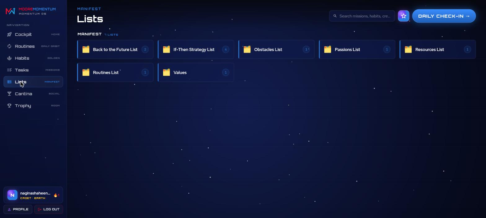
*The Command Center Lists on the desktop web build — the player's real 17‑list workspace (including the "Values" list created during verification and the "Resources List" that Ideas Well adopts write into). Expanding a list reveals its items for editing.*

### #14 Tasks screen — real to‑do list ✅

**What this is:** The Tasks screen was pure mock ("Q3 report draft"…). It's now a real, persistent to‑do list with three buckets — **Today / Tomorrow / Later** — supporting add, complete, edit, move‑between‑buckets and delete.

**Source — Document A**, the Command Center's task/checklist surface for day‑to‑day execution (distinct from the habit system).

**Built:** a new `TaskService` backed by direct Firestore at `/users/{uid}/tasks/{taskId}` (the same direct‑write pattern as check‑ins), with optimistic UI. **Points are deliberately NOT wired** — a per‑task MP reward is undesigned Phase‑2 economy (`[PLACEHOLDER]`), so nothing is fabricated. **Device‑verified** on the physical Pixel 6, including a **force‑stop + cold relaunch round‑trip** (task stayed in its bucket, still marked done).

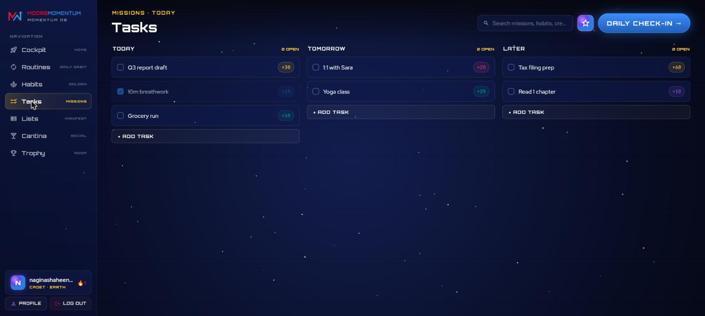
*The real Tasks board on the desktop web build — three persistent buckets (Today / Tomorrow / Later) with add, complete (strikethrough + "N OPEN" count), edit, move and delete, all backed by Firestore.*

### #14 Space Cantina V1 — the social hub goes real ✅

Completing Stage 2 unlocks the Space Cantina (see #4). Its four‑tab hub used to be seeded mocks; three of the four pillars are now real, backed by Firestore.

**Source — Document D (Space Cantina – Social Component)**, the V1 native rollout: Ideas Well (upvote + click‑to‑adopt), Space Tribes (≤20 members, ≤3 joined), Accountability Partners (one active, daily/weekly cadence), and the anti‑shame leaderboard — all under the doc's anti‑shame UI rules.

**Built — Pillar 1 · Ideas Well:** a real community idea feed (`space_cantina_posts`) with **idempotent upvoting** and **click‑to‑adopt** — adopting a habit idea forges a real Golden Habit (and lights up its Core), a tech idea appends to the player's Resources List. Needed a new Firestore rule for the shared collection (deployed via the Rules REST API; snapshot saved at `/firestore.rules`). **Fully device‑verified** on the Pixel 6 — seeded feed loads, upvote and both adopt paths round‑trip across a cold restart.

**Built — Pillar 2 · Space Tribes:** real tribes on a top‑level `tribes` collection with **My Tribes / Discover** segments, **Join/Leave** (≤20‑member cap, ≤3‑joined limit), **Create tribe**, and an in‑tribe **discussion feed**. **Fully device‑verified** — joined a tribe, posted a message, created a tribe; membership and message both survived a cold restart.

**Built — Pillar 2b · Accountability Partners:** one active partner with daily/weekly cadence, stored at `users/{uid}/accountability/active` (under the player's own doc → no new Firestore rule needed). Pair with a buddy → **check in** (gated once per cadence period) → **end partnership** (frees the slot). V1 pairs with a curated NPC crew (same NPC‑vs‑real honesty as the leaderboard); real 2‑way matching is a V2 cloud function. **Browser‑verified end‑to‑end** on the web (the primary surface): pair → check‑in → cold reload + re‑login round‑trip → end. The cadence due‑date logic is unit‑tested **9/9** (`test/accountability_pairing_test.dart`).

**Still open:** Pillar 3 (anti‑shame Leaderboard — the multi‑factor 60/25/15 board recomputed every 6h; its ship‑upgrade weighting depends on the blocked #13d numbers) and Pillar 4 (Weekly Competitions / Arena — explicitly V2/deferred).

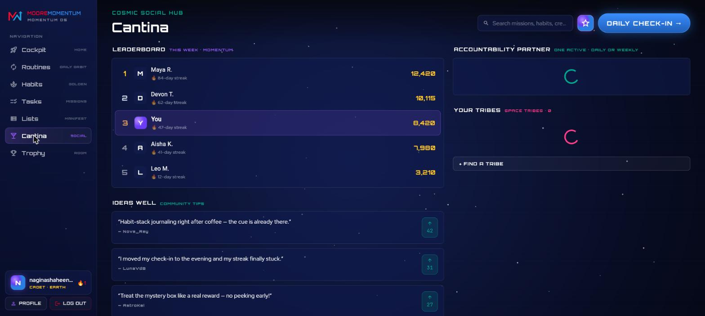 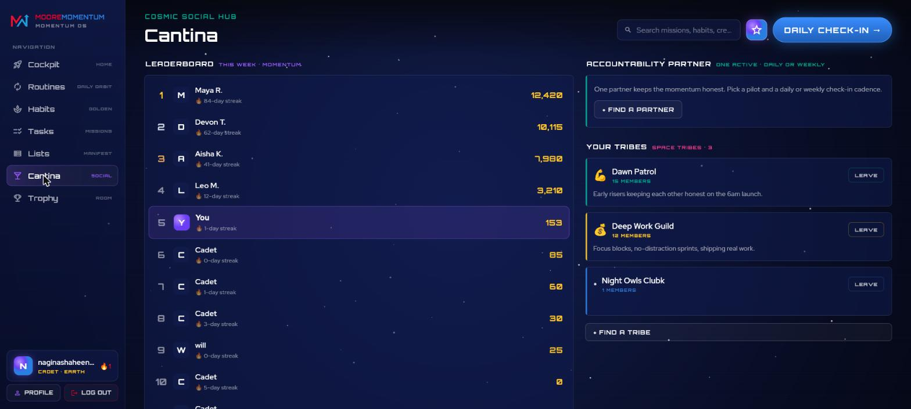
*The Space Cantina on desktop web. Left: the Leaderboard + Ideas Well (real community tips with upvote counts). Right: the same hub scrolled to the Accountability Partner panel ("Find a Partner") and Your Tribes — 3 real joined tribes (Dawn Patrol / Deep Work Guild / Night Owls) each with Leave, plus the anti‑shame Leaderboard where the player sits at their real 153 momentum among the crew.*

---

## Web — desktop is now the primary product ✅

**What this is:** Moore Momentum now ships a proper **desktop web experience**, not a stretched phone screen. At ≥900px the app renders a desktop shell (persistent left sidebar + top bar) around a flagship **Web Cockpit** built on the player's real data, plus desktop layouts for the secondary screens.

**Source — product direction (2026‑07):** the web/desktop surface is the main shipping product; the desktop UI is designed distinctly from the mobile UI rather than reused.

**Built:** a responsive `WebShell` (sidebar + topbar) that engages at ≥900px and caps content width on ultra‑wide screens; a `WebCockpit` on the real profile/check‑in data; and desktop variants of the secondary screens (including a `WebCantina` with the Accountability Partner section). Several web‑specific fixes shipped alongside — non‑blocking startup notification init so a fresh browser paints immediately, a dark page background to avoid white flashes on resize, and Co‑Pilot layout/icon corrections. **Browser‑verified** via the running dev server and claude‑in‑chrome. The flagship desktop layout is the **Web Cockpit shown in the Space Credits section above** — a persistent left sidebar (Cockpit / Routines / Habits / Tasks / Lists / Cantina / Trophy) around a three‑column mission‑control cockpit; the Tasks, Lists and Cantina screenshots above are all this same desktop web build.

---

## Mobile — planet states brought to parity with the Cockpit ✅

**What this is:** the phone build could show *where* the player was (a small journey arc at the bottom of
the dashboard) but none of the **planet‑state functionality** the desktop Cockpit's centre stage has. The
mobile dashboard now runs that same stage.

**Source — gap reported 2026‑07‑29:** "mobile view is missing all the functionality to view the planet states."

**Built:** the mobile Rocket Dashboard's hero is now the shared `JourneyStage` (replacing the static
`RocketWidget` **and** the bottom `JourneyArc`), in a new `compact` mode:

- **Zoomed in it is the cockpit rocket** — the same tappable Cores, at‑risk badges and streak, so nothing
  from the old dashboard is lost.
- **Planet rail** down the **left** edge — the whole Earth → Station route with each stop marked
  *visited · current · locked*; tapping one **replays that arrival** (the rail keeps the player's real
  position — a replay is a preview, never a move).
- **Zoom control** beside it flies between the cockpit and the whole route without leaving the dashboard;
  on touch the route also **pinches**.
- **Arrival cinematic** now plays on mobile when the player reaches a new planet — pull back, cruise the
  leg, land with touchdown dust, then the hull peels open back onto the cockpit. Persisted per planet, so
  a refresh never replays it.
- **Warp starfield** — the stage publishes its star speed to the page's `MovingStarfield`, so the stars
  streak during a leg and settle to idle drift when parked.
- The **Daily Check‑in** pill and the **Co‑Pilot** now share one line beneath the stage (the Co‑Pilot no
  longer floats over the rocket).

**Also built:** a full‑screen **Journey Map** (`journey_page.dart`) for the same route with a vertical
control rail (back · NOW / NEXT / TO NEXT readouts · zoom · the state of the stop being shown), reachable
from the dashboard's PLANET readout and the menu drawer. On desktop that route redirects to the Cockpit,
which already *is* the journey stage.

**Shared‑widget changes:** `JourneyStage` gained `compact` (phone‑sized rail/zoom metrics), `controlsOnLeft`
(rail + zoom on the left so the right edge stays free), an optional external `zoomController` so a host can
place the zoom control itself, pinch‑to‑zoom, and an `onDockedChanged` callback. The desktop Cockpit's use
of it is unchanged.

**Verification:** analyzer‑clean; run in the browser at phone width against the dev server. The release
web bundle (`build/web`) was rebuilt on top of these changes.

---

### Parabolic flight path (client change, 2026‑08‑01)

**What this is:** the rocket flew every leg as a **straight vertical line** up a single lane. The client
asked for the route to curve. Only the flight path changed — the hull reveal, cockpit dashboard, planet
rail, zoom control and warp starfield are untouched.

**Source:** the client‑approved prototype is the **project‑root `Rocket Journey.html`** in the claude.ai
design project (`019e1281‑94ae‑723b‑997d‑a45b175e35fc`). ⚠️ The bundled
`design_handoff_rocket_journey/README.md` is **out of date** — it still documents the straight‑line route,
a 1600‑wide world and "legs are straight vertical lines, so a simple lerp is enough", and it has no `dx`
column at all. Use the root prototype for route geometry; the README is still correct for timings, hull
bounding boxes and the dashboard overlay tables.

**Built** (all in `lib/widgets/momentum/journey_stage.dart`):

- **World widened 1600 → 2000**, lane centre 800 → 1000. Planets are now **staggered** left and right of
  the lane via a new per‑stop `dx` (earth 0 · moon +360 · mars −340 · jupiter +380 · saturn −300 ·
  pluto +360 · station 0); Earth and the Station stay centred.
- **`JourneyLeg`** — each leg is a **quadratic bezier** whose control point bows `kBow = 330` to one side,
  **alternating by leg index**, giving the route its S‑sweep.
- **The nose follows the curve's tangent** (`atan2` → degrees, 0° upright), so the rocket leans into the
  arc on liftoff and **straightens to upright as it lands**. Rotation pivots at 50% / 88% of the sprite —
  near the engine — so the nose swings rather than the whole body sliding.
- **Camera gained a focus‑x.** `_Cam` now carries `fx`; `landedCam` focuses the planet's own centre and
  `_camPin` lerps focus x across the zoom beats. Previously the transform hard‑coded the lane.
- **Leg framing spans the arc, not the planets.** The bow carries the rocket outside both bodies, so
  `_legCam` fits the curve's true horizontal extent (via the quadratic's x‑extremum) plus the rocket's
  half‑width — otherwise the rocket flies off the side of the ~500 px Cockpit panel mid‑cruise.
- **The drawn trajectory** is now a dashed **bezier** matching the flown path, walked with `PathMetrics`
  (a curve can't be dashed by stepping a straight direction vector). Completed legs stay teal.
- Planet **labels** now centre on each body rather than the world, since the bodies are off‑lane.

Unchanged by design: three‑beat timing (1000 / 2600 × 0.88^i / 1500 ms), `easeInOutCubic` + `easeOutCubic`,
geometric scale blending, screen‑position pinning, touchdown dust, hull reveal depth and frames, the planet
rail, the zoom bar, and the warp starfield.

**Verification:** analyzer‑clean (0 errors); `flutter build web --release` succeeds. Verified visually in
Chrome against a release build — staggered planets, dashed arcs bowing alternately, the rocket rotated
mid‑cruise following the tangent, straightening upright on touchdown, and the hull reveal playing after
arrival exactly as before.

**Also fixed:** `lib/services/notification_service.dart:16` carried an uncommitted stray `i` after
`NotificationService._();` that broke the build outright (two analyzer errors). Removing it restores the
file to its committed content.

---

### Co‑Pilot console — text on the cockpit screen (client change, 2026‑08‑03)

**What this is:** the Co‑Pilot (Nova) reply arrives in two parts — text and images. Until now the page
stacked them: image stage on top (≈40% of the screen), transcript underneath, input bar at the bottom.
The client asked for a different split, so this is a **second, parallel page** — the original is untouched
and still on disk, so the two can be compared before one is dropped.

**Built** — `lib/screens/copilot_console_page.dart` (`CopilotConsolePage`), new file:

- **Text lives inside the cockpit monitor.** The screen art `design/ref/pagewise/6/mantra.png` is now
  `assets/images/mantra.png`, drawn at its true aspect (1174×2390) with the transcript positioned on the
  glass. The glass rect was measured off the PNG (x 0.089→0.908, y 0.143→0.967) and the content inset
  inside it so text clears the large corner radius.
- **The status band is reserved.** The art draws two curved teal rules across the top of the glass; the
  status line (`NOVA · ONLINE`) sits between them and nothing else is drawn in that band — the transcript
  starts below the lower rule. Both rules bow, so the band is measured at its tightest (upper rule as low
  as y 0.187 at the edges, lower rule as high as y 0.279 at centre).
- **The monitor hangs from the top of the screen.** Its cable has to reach the top edge to read as
  hanging, so the artwork is top‑aligned (spare height goes below it, never above) and the `CO‑PILOT /
  Nova` title floats over the empty space beside the cable instead of pushing the whole rig down.
- **One input bar** directly under the monitor — a dark console pill (`_ConsoleInputBar`, local to the
  page so the original page keeps its light `ChatInputBar` unchanged).
- **Images take the screen over instead of sharing it.** When a reply carries images the console is
  hidden, the frames play full‑bleed in order (cross‑fade between frames), and when the last frame has had
  its turn the page fades back to the console — where the reply's text is already waiting in the
  transcript. Tap anywhere, or the SKIP control, to end it early; a dead image URL falls back to the
  rocket art rather than stranding the player on a blank screen.
- Bubbles are re‑styled for black glass (translucent teal / violet with a `NOVA` / `YOU` label) — the
  original page's white pills glared against the dark screen.

**Unchanged:** the backend contract. Same `ChatService`, same three Voiceflow‑backed endpoints
(`vfLaunchConversation` / `vfSendMessage` / `vfGetLatestMessages`), same offline cache and banner. Only
presentation moved.

**Unlinked, not deleted:** every Co‑Pilot entry point (`momentum_home.dart` `_openChat`, used by the
Dashboard FAB, the web sidebar button and the menu drawer, plus `welcome_page.dart`) now opens
`CopilotConsolePage`. `lib/screens/ai_chat_page.dart` is still in the repo, marked as unlinked at the top
of the file — swapping the import in `momentum_home.dart` back restores it.

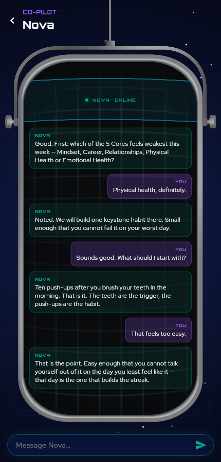
*The transcript on the cockpit glass, the monitor hanging from the top of the screen. The status line is
alone in the band between the two teal rules; the type bar sits directly under the monitor.*

*A reply carrying images hides the console and plays the frames full‑bleed (dots show the position in the
sequence, SKIP ends it early); the console fades back when the last frame is done.*

**Verification:** analyzer‑clean (0 errors, no new warnings). Run in Chrome against the dev server at
phone width (430×900) and desktop width (1440×900): text framed on the glass at both, the status line
centred in its band, a 3‑frame sequence taking the screen over and handing it back to the console
automatically.

**Fix (2026‑08‑10): Nova's markdown now renders as formatting.** The agent writes its replies in light
markdown — `**The Law of Environment Design:**`, `*"Connect before you correct."*` — and the console was
printing the asterisks literally. Text between `**` is now **bold** and text between single `*` is
*italic*, with the markers removed. Anything unmatched (a stray `*`, an unclosed `**`, a multiplication
sign) is left exactly as the agent wrote it, and emphasis can't run across a line break, so one loose
asterisk can never bold the rest of a reply. Underscores are deliberately untouched — they appear in ids,
urls and the agent's `>___` divider lines. Implemented as `lib/widgets/momentum/chat_markdown.dart`
(`ChatMarkdownText`), used by the transcript on the glass and by the chat panel that opens over an image
sequence. Covered by `test/chat_markdown_test.dart` — **9/9 passing**.

**Fix (2026‑08‑10): the transcript came back at the top of the history.** When an image sequence finished
and handed the screen back, the player was returned to the *oldest* message and had to scroll down to find
their place. The page's `AnimatedSwitcher` swaps the whole console out for the animation, so the transcript
widget is rebuilt from scratch on the way back — and it only scrolled in response to *new messages*, never
on mount, leaving the fresh list at offset 0. It now pins to the newest message on mount (a jump, not an
animated scroll — animating a first paint reads as the screen scrolling by itself), settles once more a
frame later for late text reflow, and re‑settles after the new‑message scroll in case a reply is still
growing while it animates. Verified in Chrome: a cold open of the Co‑Pilot lands on the last message.

---

### Celebrating points (client change, 2026‑08‑10)

**What this is:** points were landing silently. Every award now gets a celebration — a confetti burst and
a "+N MP" badge that pops in over whatever screen the player is on.

**The Voiceflow path needed no new backend.** Nova already calls two FlutterFlow‑side endpoints when it
awards points, and between them they carry everything the celebration needs:

- `updateUserPoints({ userId, type: "Pain Points", points: 10 })` → writes the award to the points ledger
  (`users/{uid}/points/summary/history`) and bumps the running total.
- `handleVoiceflowEvent({ userId, eventName: "CELEBRATION" })` → merges one doc per player at
  `vf_events/{uid}` = `{ eventName, status, payload, eventCount }`.

The app **snapshot‑listens** to that event doc (real‑time, not polling), keys replay off `eventCount`, and
reads the newest ledger entry for the amount and label — so the badge shows the agent's real award
("+10 MP · PAIN POINTS"), never a fabricated number. If the ledger read comes back empty or stale the
confetti still plays, without a figure. The `vf_events` rule is read‑only to clients, so "already
celebrated" is remembered on the device rather than written back — **no Firestore rules change was needed**,
and the first read after a fresh login only sets a baseline, so opening the app never replays an old
celebration.

**Built** — `lib/widgets/momentum/confetti_overlay.dart` (`ConfettiOverlay`, a hand‑rolled particle
painter — no new dependency, and it renders identically on the web build; plus `PointsPopBadge`),
`lib/widgets/momentum/celebration_host.dart` and `lib/services/celebration_service.dart`. The host is
mounted once in `momentum_home.dart` and draws into the **root overlay**, so the burst appears over pushed
routes (the Co‑Pilot console) as well as the cockpit screens. The award moments that don't raise a
Voiceflow event are wired directly: the Daily Check‑In recap (`earnedToday`, bigger burst on a streak
milestone), the Stage 2 "Momentified / Cantina unlocked" screen (+50 MP) and the Stage 1 Command Center
unlock. A shared claim‑window stops the Voiceflow burst and the HHS achievement card from firing twice for
the same award.

**Verification:** analyzer‑clean. Verified live in Chrome on the logged‑in account: posting a real
`updateUserPoints` + `handleVoiceflowEvent` pair produced confetti over the Cockpit with the matching
badge — "+10 MP · PAIN POINTS", and again "+25 MP · KEYSTONE FORGER". **Bug found and fixed during that
verification:** the first attempt painted nothing at all — an `OverlayEntry` is laid out with *loose*
constraints, so the burst's `Stack` of `Positioned.fill` children collapsed to zero size; the entry now
returns `Positioned.fill` as its root. (The in‑page bursts were never affected — their stacks get tight
constraints from the surrounding scaffold.)

**Open item for the client:** `handleVoiceflowEvent` rejects a call without the shared `secret` (verified
by curl — `{"ok":false,"error":"Invalid secret"}`). The agent step as written passes only
`userId`/`eventName`/`status`, so please confirm the Voiceflow API block sends the secret too, otherwise no
event doc is ever written and the celebration can't fire. (`status` in that call is ignored — the function
always writes `"New"` itself.)

---

## 3. Engineering notes (for your technical reviewer)

- **Backend isolation:** all new cloud functions live in the **Flutter‑only** functions codebase (`vf-bridge/functions-flutter`), never in the FlutterFlow `index.js`. Cloud endpoints added across the build: `flutterSavePhase1State`, `flutterSaveMomentumMethods`, `flutterFlagGoldenHabit` (client wiring), `flutterAwardCheckinPoints` (points **and** streak **and** Space Credits in one transaction), `flutterSetHabitFormed` (formation + 25💎), plus read endpoints `flutterGetUserProfile` / `flutterGetGoldenHabits` / `flutterSyncOnboarding`.
- **Points schema:** `users/{uid}/points/summary.total` is the source of truth for `momentumScore`, mirrored to `users/{uid}.points`, with an immutable `history` sub‑collection of awards.
- **Credits schema (#13a):** parallels the points schema — `users/{uid}/credits/summary.total` (source of truth for `spaceCredits`) + immutable `history` sub‑collection + a `users/{uid}.spaceCredits` mirror. Credit awards are idempotent via deterministic history‑doc ids (`checkin_<date>`, `highscore_<date>`, `streak_<date>`, `formed_<habitId>`).
- **Direct‑Firestore features (#14):** Tasks (`users/{uid}/tasks/*`), Cantina Ideas Well (`space_cantina_posts` + `users/{uid}/cantina/*`), Space Tribes (`tribes/*` + `tribes/{id}/posts`), and Accountability Partners (`users/{uid}/accountability/active`) write directly to Firestore (no cloud function), the same pattern as check‑ins. The two shared top‑level collections (`space_cantina_posts`, `tribes`) each needed a Firestore security rule, deployed via the Rules REST API; the full ruleset snapshot lives at `/firestore.rules`. The owner‑scoped collections (tasks, accountability) are already covered by the `users/{uid}/{document=**}` rule.
- **Web build:** the desktop layouts live in `web_screens.dart` behind a responsive `WebShell` (≥900px). New backend was not required for the web build — it renders the same real data as mobile.
- **One background everywhere (browser fix):** every screen's starfield `Stack` now uses `fit: StackFit.expand` — Scaffold hands its body *loose* height constraints, so on short pages (sign‑up / sign‑in) the Stack shrank to its content and left a black band of page background below the fold. On desktop the starfield is now painted **once**, full‑bleed, by `WebCenteredFlow`; screens inside it find a `WebFlowScope` and render transparently over it (previously the centred phone‑width column repainted its own starfield and read as a brighter stripe). The intro carousel still tints that shared starfield per page via the scope's accent.
- **Verification:** every feature was exercised on a real device/emulator or in the browser and, where it touches the backend, confirmed against the live endpoints (many via a cold‑restart round‑trip). Effects that need multi‑day history to fire live (the #7 auto‑flag, #8 5‑day alert, auto habit‑formation) have their UI, persistence and day‑counting logic verified — they simply can't be "clicked" without several calendar days of data.

---

## 4. What's next

The core product loop (#1–#12), the **Space Credits earning loop** (#13a/#13g), the **productivity tools**
(Lists editing + Tasks), and **three of the four Cantina pillars** (Ideas Well, Tribes, Accountability
Partners) are all built and verified. What remains splits into work that's ready and work that's **blocked
on decisions/numbers only you can provide**:

**Ready to build now:**
- **Cantina Pillar 3 — anti‑shame Leaderboard** (the multi‑factor 60% momentum / 25% ship / 15% achievements board, recomputed every 6h). *Caveat: the ship‑upgrade weighting depends on the #13d ship numbers below.*

**Blocked on your input (`[PLACEHOLDER — DETAIL NEEDED]` in your Gamification doc):**
- **#13b Leveling** — the Cadet → Navigator → Commander thresholds (formed‑habits / planet / streak per transition).
- **#13c Planet journey** — MP per planet, arrival bonus credits, regression threshold.
- **#13d Ship upgrades** — per‑tier credit costs **and** the rocket art assets (the 12 functional variants don't exist yet — this is asset production, not just numbers).
- **#13e Mystery Box** — the exact drop rate (you specified a 10–15% range; pick one).
- **#13f Badge / Trophy library** — the full badge list (names / criteria / rarity), which also fills the Trophy Room "Achievements" tab.
- **#13h Skip‑Check‑in purchase** — the skip‑day options + credit costs (surfaced by your `gam‑09` mockup).
- The **Space Credits Balance bonus** amount (the only earning source still undesigned).

**Explicitly deferred (V2):** Cantina Pillar 4 — Weekly Competitions / Arena.

*All screenshots in `./images/` were captured from the working app during this build — #1–#12 on a
physical Pixel 6 / emulator, and #13 / #14 / web from the desktop web build in‑browser (signed in as a
real account) on 2026‑07‑22.*
